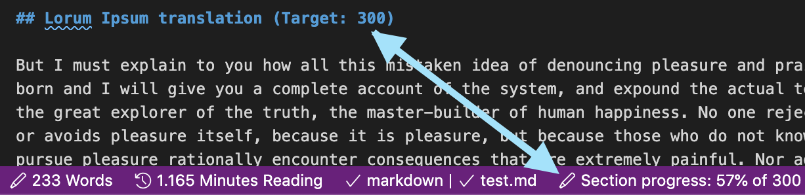

# Section Word Count Targets

This VSCode extension searches markdown headers for trailing text that includes `(Target: NNN)` where `NNN` is a number (no commas or periods). It than calculates the text between two headers and, if the previous header has a target, displays the completion percentage.

## Requirements

This is an adaptation of the [word count extension example](https://vscode.readthedocs.io/en/stable/extensions/example-word-count/).

By [Christopher Witulski](https://cwitulski.com). The source code is available on [GitHub](https://github.com/cjwit/section-word-count-targets).
